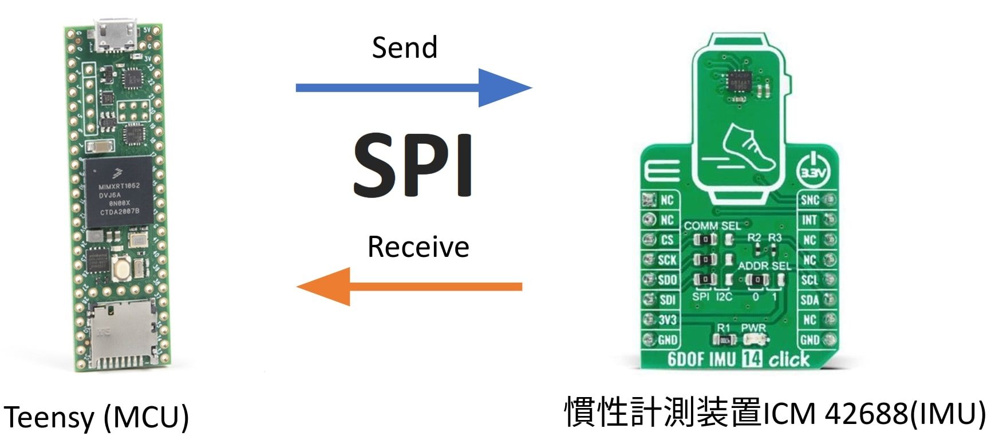
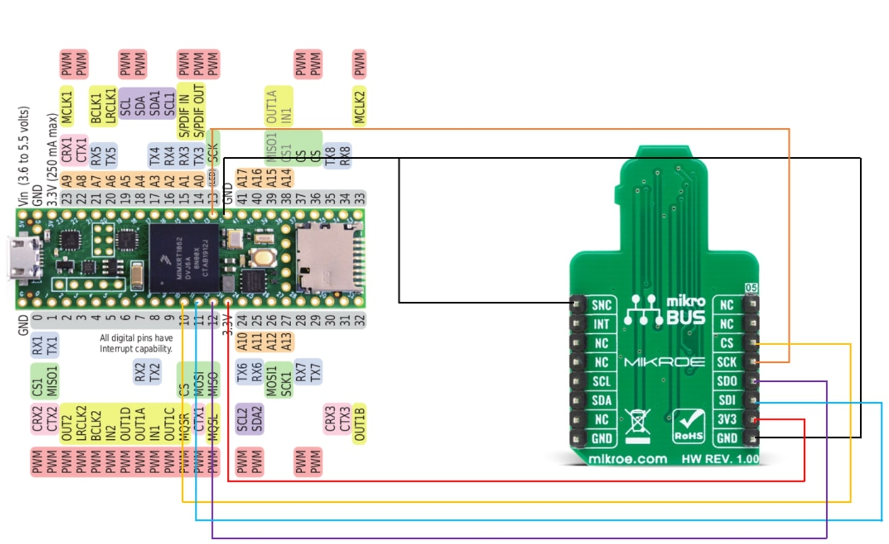
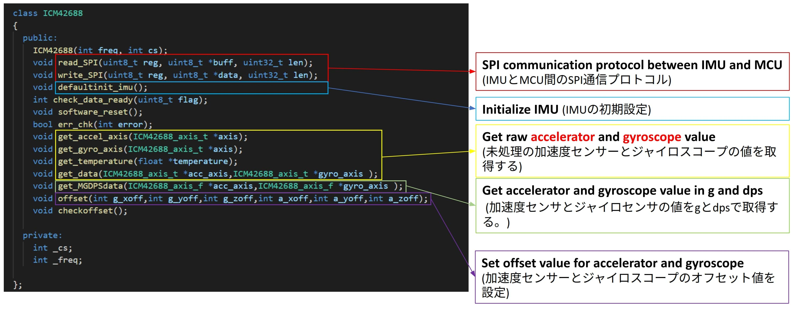

# ICM42688-ArduinoLibrary
***Author:*** Sam Tan (chijie1998@hotmail.com)

Just a casual Arduino IDE library for 6 DOF IMU, ICM42688.

This device is relatively new and I could not find any existing arduino library from the internet, hence decided to write it myself as a part of my project needs this IMU to work with Teensy 4.1 using Arduino IDE.

### Important Notes
This library only provides basic functions such as initialize IMU, get temperature, gyro and accel data, check and set offset which is sufficient for normal uses. 
This library provides fixed initialization during device start up ( Accel config 2G 100Hz, Gyro 31.25dps 100Hz ). You may need to change the code in the function of defaultinit_imu() and get_MGDPSdata() in ICM42688.cpp for the scale that you desired. 

On the side notes, only SPI connection is supported for this library.

### Demonstration Video

### Wiring with Teensy 4.1 

          
### Wiring with Arduino Uno or other microcontroller
Please refer to connection of Teensy 4.1, just connect the wires according to your microcontroller SPI pins. 

Please becareful of the voltage if you are using Arduino Uno, you need to step down the voltage on the SPI lines and input voltage to 3.3V as the IMU is running at 3.3V. 

### Kalman Filter
Modify Kalman Filter from [Osoyoo](https://github.com/osoyoo/Osoyoo-development-kits/tree/master/OSOYOO%202WD%20Balance%20Car%20Robot) to be compatible with this library to obtain tilted angle from IMU data. 

### Installation 
1. Download Arduino IDE and Teensyduino following this [official guide](https://www.pjrc.com/teensy/td_download.html). If you are not using teensy you may ignore this, you only need the arduino IDE. 

2. Find your Arduino folder usually located at Home. Download and put the ICM42688 and KalmanFilter folder in Arduino/libraries.

3. Open Arduino IDE, select Sketch and include libraries. You should be able to see and choose ICM42688 and KalmanFilter.

4. You may follow the guide from [Arduino](https://docs.arduino.cc/software/ide-v1/tutorials/installing-libraries) too if step 2 and 3 does not work for you.

### Available Functions 

You may refer to the Example and readme on how to call and use the functions.

librarytest.ino demonstrates on how to use the basic functions to initialize and get gyro and accel data to compute tilted angle using Kalman Filter. 

IMUandKalman.ino demonstrated on how to use interrupt in Teensy to get IMU data every 50ms and print on serial monitor. 

### Credit and References

[ICM42688 datasheet](https://datasheet.octopart.com/ICM-42688-P-InvenSense-datasheet-140604332.pdf)

[Mikroe Libraries](https://www.mikroe.com/6dof-imu-14-click)

[ICM20948 Arduino Libraries](https://github.com/dtornqvist/icm-20948-arduino-library)
